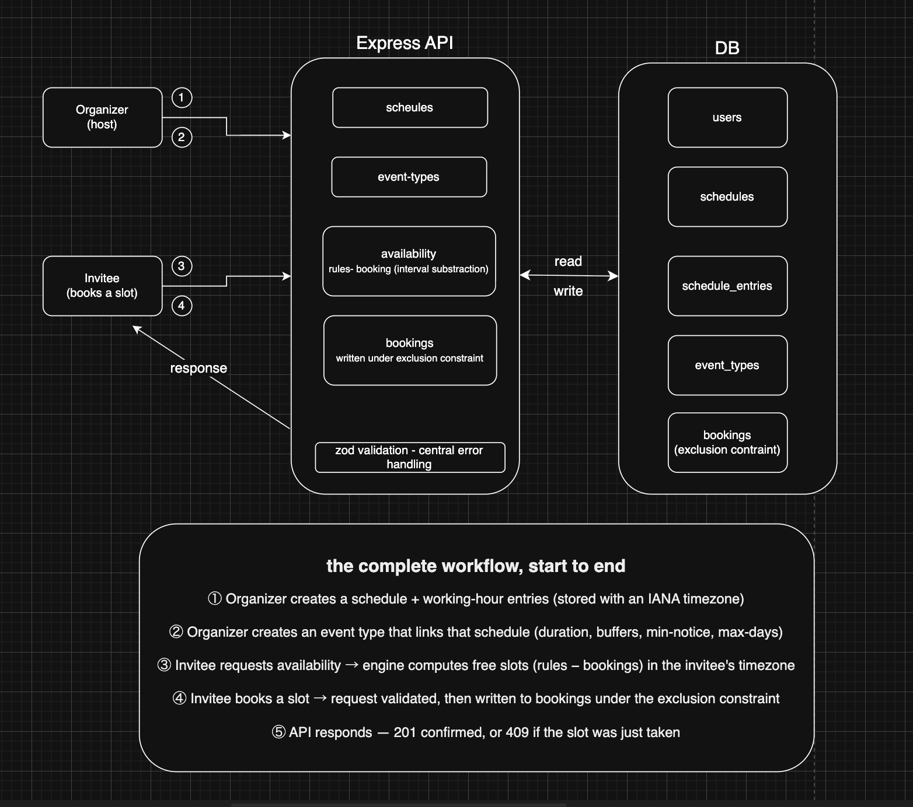
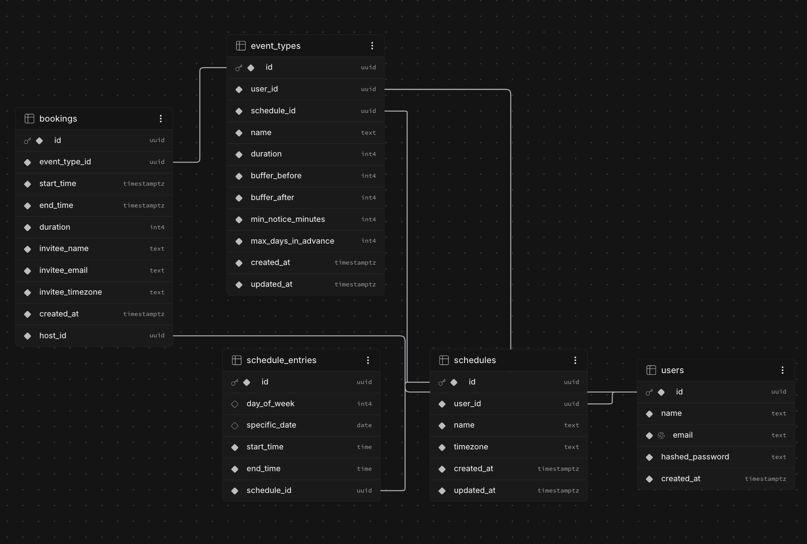

# Meeting Scheduler API

A Calendly-style scheduling backend. Organizers define availability schedules and event types; invitees book slots against dynamically computed availability. Built with Node.js, TypeScript, Express, PostgreSQL, and Drizzle ORM.

1. **Timezone correctness** — instants stored in UTC, organizer zones stored as IANA names, recurring rules resolved to UTC against a specific date (DST-safe).
2. **Dynamic availability engine** — free slots computed on the fly via interval subtraction (a pure, unit-tested function), never pre-stored.
3. **Concurrency / double-booking prevention** — two simultaneous requests for one slot resolve to exactly one booking, enforced at the database level.

## Architecture

## Data model

`bookings` carries a denormalized `host_id` and a Postgres `EXCLUDE USING gist` constraint (via `btree_gist`), so two overlapping bookings for the same host can never both commit.

